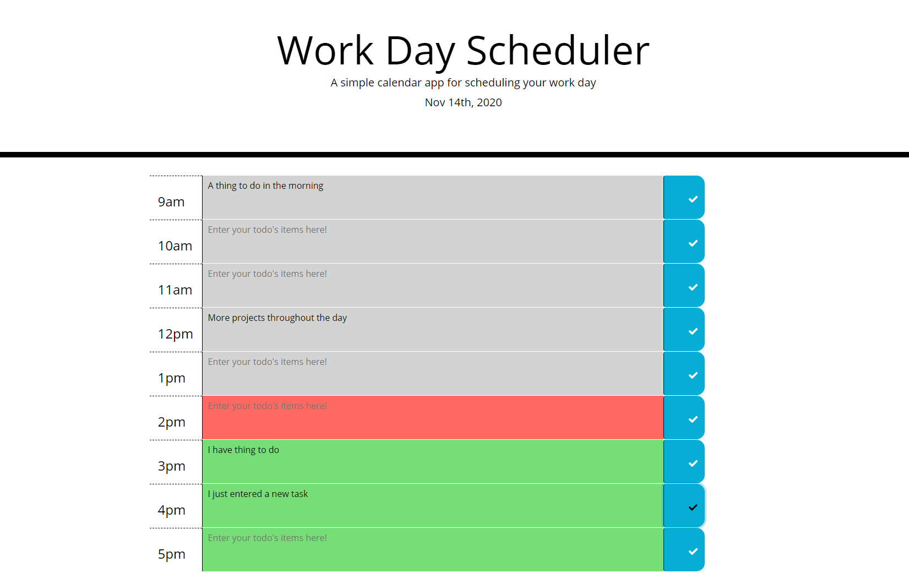

# Word Day Scheduler

## Table of Contents
The following readme contains these sections:

* [Screenshot](#Screenshot)
* [Usage](#Usage)
* [Live-Link](#Live-Link)
* [License](#License)

## Screenshot

## Usage

[This Work Day Scheduler](https://joey-sisk.github.io/WorkDayScheduler/) was designed using vanilla JavaScript, HTML, CSS, as well as the library extensions JQuery, Bootstrap, FOnt Awesome, and Moment.This day planner features 9 text areas that can be filled out with inportant todo's and notes for laying out your day. When you click the button to the right your input will be saved for future refrence. When you load or refresh the page the schedule will auto populate with everything you last saved to the planner. The current day is displayed at the top of the screen and the current hour is represented by the color of the text fields. The user will know that their input is saved because the check mark in the button will change color. 

This would not have been possible without the help of my tutor Kumar Ramanathan, my instructor Calvin Carter, all of the class TA's, and many of my fellow UT Bootcamp students.

## Live-Link

[You can find a link to the live site here.](https://joey-sisk.github.io/WorkDayScheduler/)

## License

There is not currently a license for this service as it is only a homework assignment for the UT Coding Bootcamp Class 2020-2021
